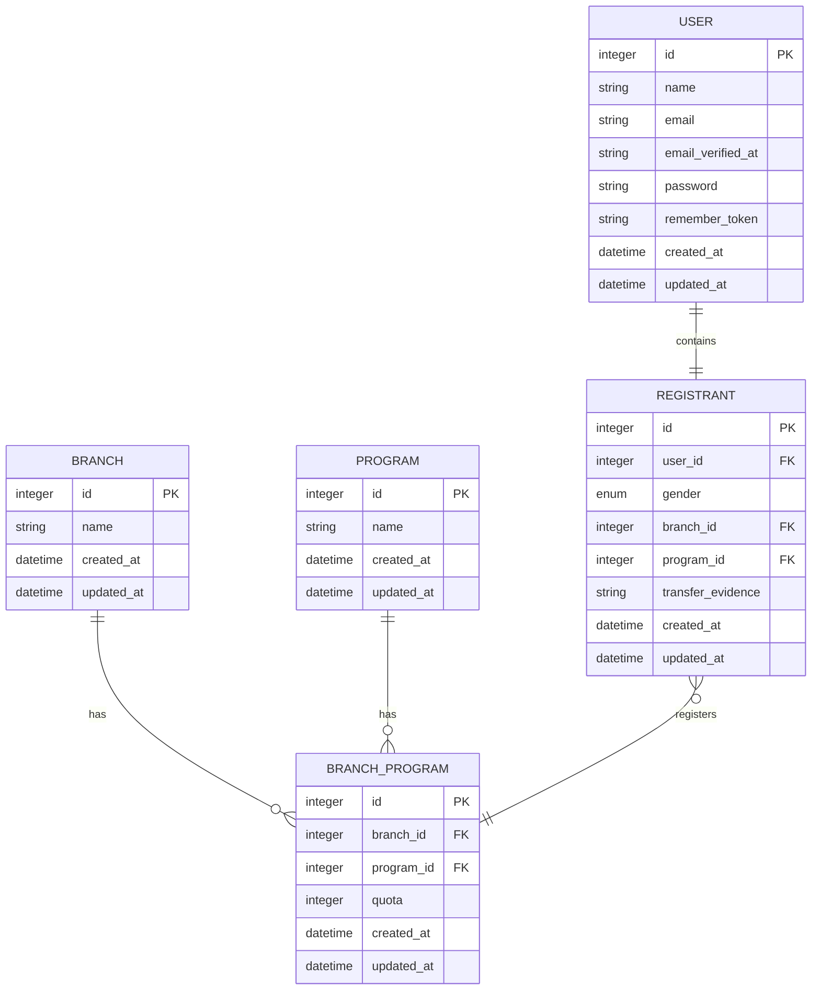

# IDN Boarding School Student Admission

## About

Projek ini adalah mini-projek dengan fitur pendaftaran siswa baru sekolah IDN Boarding School.

## Installation

1. `composer install`
2. `npm install`
3. Copy .env then do `php artisan key:generate`
4. `php artisan migrate`
5. `php artisan serve`

## Made Of

- Laravel 10
- Livewire 2
- AlpineJS
- Bootstrap (AdminLTE)

## Tech Docs

### ERD

